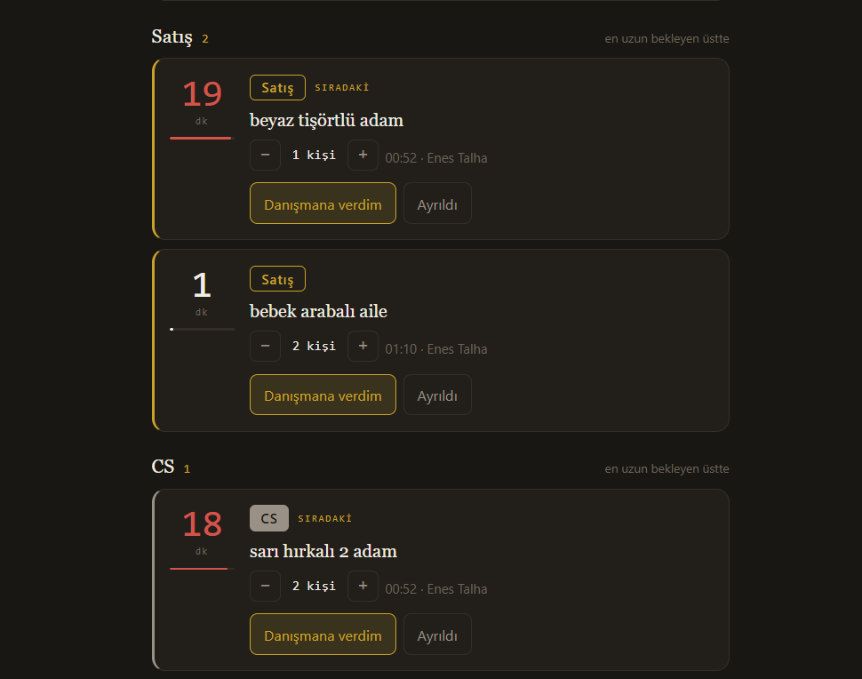
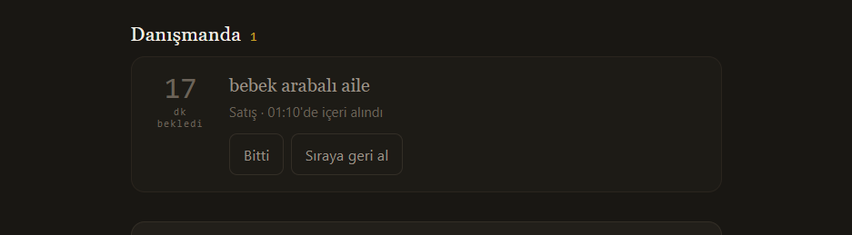
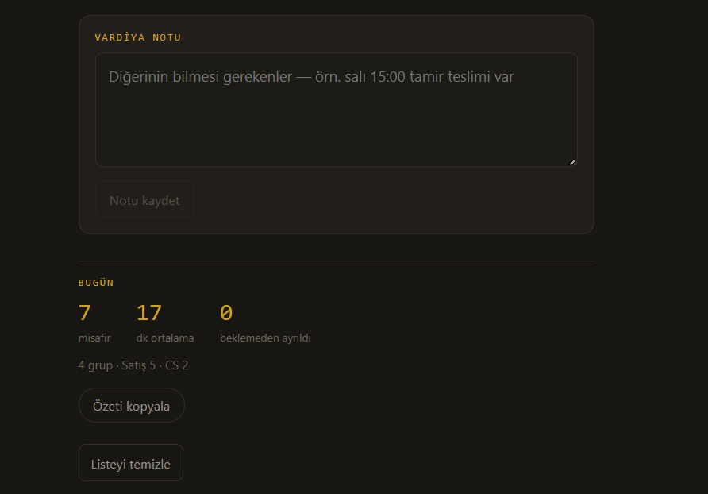

# Boutique Queue Tracker

A real-time customer queue management system built for a retail boutique. Staff can register waiting customers, track live wait times, hand customers off to an advisor, and see daily performance summaries, all synced instantly across every device in the store.

Originally built as a quick internal prototype, it was well received by store management and is now used daily in production, with a pilot rollout under consideration for a shopping mall location.

## Screenshots

## Features

Separate live queues for Sales and Customer Service. Real-time wait-time tracking, color-coded by how long a customer has been waiting. One tap to move a customer to "with advisor" or mark them as done or left. Daily summary showing total guests, average wait time, and guests lost before being served. Shared shift notes for handoffs between staff. Each day's data is stored as its own record, so historical data is preserved automatically. Google Sign-In with a server-side allowlist, so only authorized staff can view or edit the queue and the public cannot access it at all.

## Tech stack

Frontend: React and Vite. Auth: Firebase Authentication, using Google Sign-In with a redirect flow for mobile compatibility. Database: Firebase Firestore, using onSnapshot for real-time sync across devices. Hosting: Firebase Hosting.

Access control is enforced in two layers. src/AuthGate.jsx is a client-side gate that shows a not-authorized screen, but this is UX only. firestore.rules is the actual security enforcement, evaluated server-side, and this is what actually prevents unauthorized reads and writes regardless of what the client does.

## Setup

Step 1, create a Firebase project. Go to the Firebase Console at console.firebase.google.com and create a new project. Under Build, Authentication, enable the Google sign-in provider. Under Build, Firestore Database, create a Firestore database using Standard edition and Production mode. Under Project settings, General, register a new Web app and copy the firebaseConfig values shown.

Step 2, configure environment variables. Copy .env.example to .env, then fill it in with the values from your firebaseConfig: VITE_FIREBASE_API_KEY, VITE_FIREBASE_AUTH_DOMAIN, VITE_FIREBASE_PROJECT_ID, VITE_FIREBASE_STORAGE_BUCKET, VITE_FIREBASE_MESSAGING_SENDER_ID, VITE_FIREBASE_APP_ID.

Step 3, set the authorized staff list. This project keeps the real allowlist out of git, see .gitignore, since it contains real email addresses. Two files need to be created locally, based on the tracked examples: src/allowedUsers.js, copied from src/allowedUsers.example.js, and firestore.rules, copied from firestore.rules.example, which is the file that actually gets deployed and enforced. Keep both lists identical.

Step 4, deploy Firestore security rules. Run npm install -g firebase-tools, then firebase login, then firebase init firestore, then firebase deploy --only firestore:rules.

Step 5, run locally. Run npm install, then npm run dev.

Step 6, deploy to production. Run npm run build, then firebase init hosting, then firebase deploy --only hosting. This gives you a live URL at https://project-id.web.app.

## Why two access-control layers?

AuthGate.jsx only controls what the UI shows, it's there for a clean user experience, a proper you-dont-have-access screen instead of a broken app. The actual security boundary is firestore.rules, enforced by Firebase's servers on every read and write. Even if someone bypassed the client entirely, the database itself would still reject them.
